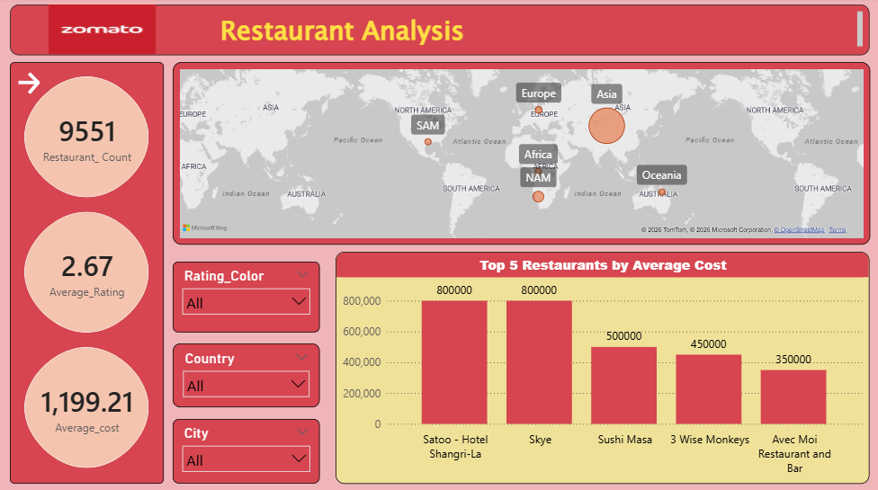
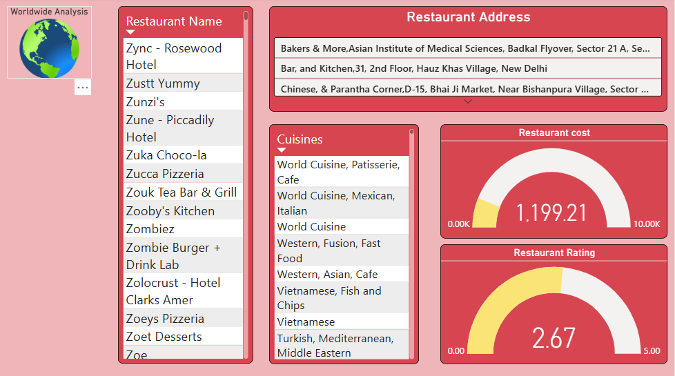
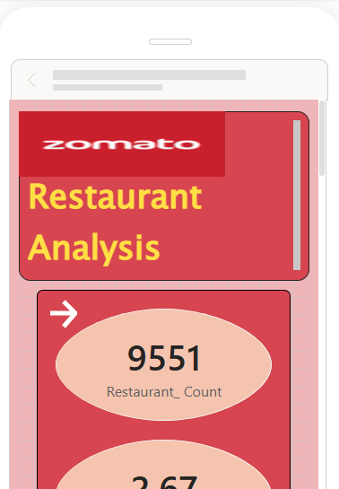
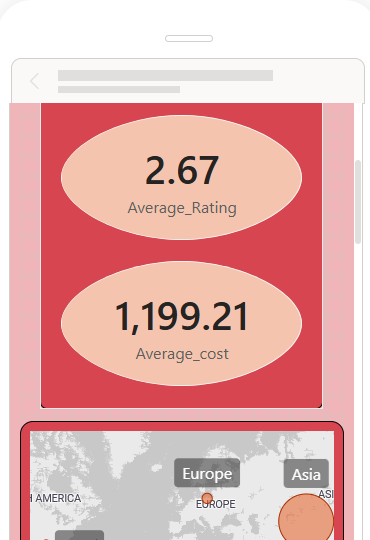
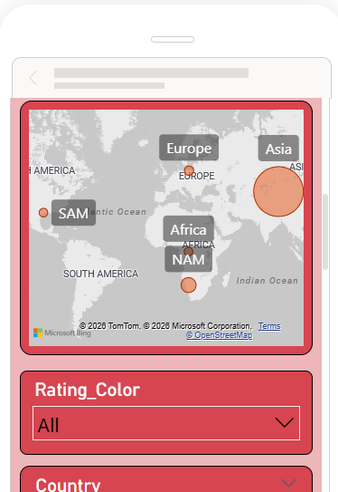
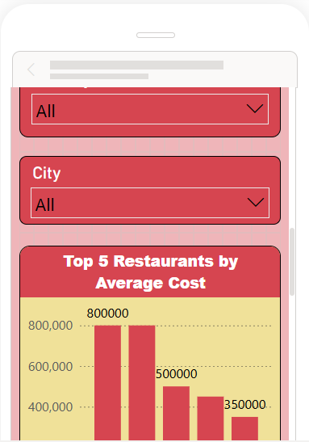
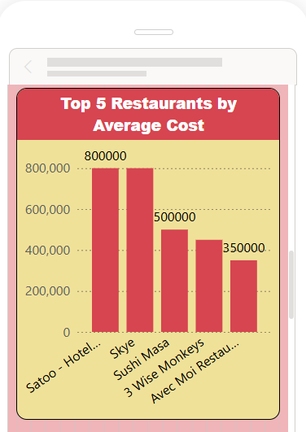

# Zomato Restaurant Analysis – Power BI

## 📊 Project Overview

This project focuses on analyzing Zomato restaurant data using Microsoft Power BI to create an interactive dashboard for assessing restaurant performance across different geographical locations.

The dashboard provides insights into restaurant count, ratings, average cost, cuisines, and geographical distribution.

## 🎯 Project Objective

The objective of this project is to build a consolidated and interactive Power BI report that allows users to:

- Analyze the total number of restaurants across continents, countries, and cities
- Explore restaurant data from a global level to a more granular level
- Analyze restaurants based on average customer ratings
- Identify restaurants based on average cost
- Analyze cuisines offered by restaurants
- Filter restaurants by continent, country, and city
- Analyze restaurants based on online ordering and reservation services
- Filter restaurants using rating categories
- Create an interactive multi-page report
- Provide a mobile-friendly dashboard experience

## 🛠️ Tools & Technologies

- Microsoft Power BI
- Power Query
- DAX
- Microsoft Excel

## 🔄 Data Preparation

The project involved importing data from multiple Excel files and preparing it for analysis.

Key data preparation activities included:

- Correcting city names
- Resolving ambiguous city names
- Removing unnecessary columns
- Creating Restaurant Name and Restaurant Address fields
- Creating a separate cuisine table
- Preparing the Country-Code table with unique and non-blank values
- Creating a Continent field based on country mapping

## 📐 DAX Measures

The following measures were created as part of the analysis:

- Restaurant Count
- Average Cost
- Average Rating
- Cuisine Count

A Rating Color classification was also created to categorize restaurant ratings.

## 📈 Dashboard Features

The Power BI report includes:

- Restaurant count analysis
- Average rating analysis
- Average cost analysis
- Geographical analysis
- Country and city filters
- Rating Color filter
- Online ordering and reservation analysis
- Top restaurants by average cost
- Restaurant name and address details
- Cuisine analysis
- Mobile-friendly report layout

## 🔢 Key Metrics

The dashboard displays the following key metrics:

- **Restaurant Count:** 9,551
- **Average Rating:** 2.67
- **Average Cost:** 1,199.21

## 📱 Dashboard

The report was designed to provide interactive analysis across different sections and includes a mobile-friendly layout.

## 📁 Project File

The Power BI Desktop project file is available in this repository:

`Mihieka_PBI PROJECT.pbix`

## 💡 Skills Demonstrated

- Data Cleaning
- Data Transformation
- Data Analysis
- DAX
- Power Query
- Data Visualization
- Dashboard Development
- Business Intelligence Reporting

## 📸 Dashboard Preview

### Worldwide Analysis

### Restaurant Analysis

## 📱 Mobile Dashboard

The report also includes a dedicated mobile layout. The screenshots below show the complete mobile dashboard from top to bottom.

### Mobile View – Part 1

### Mobile View – Part 2

### Mobile View – Part 3

### Mobile View – Part 4

### Mobile View – Part 5

